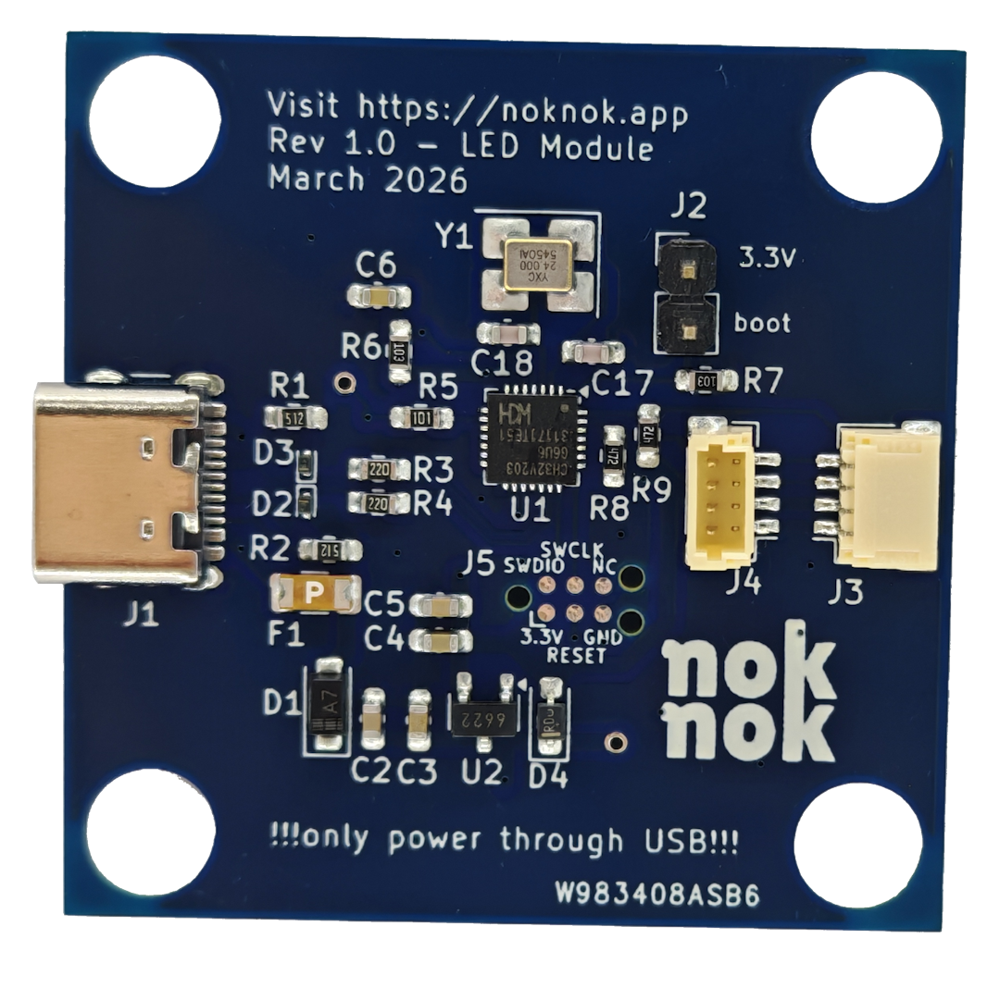
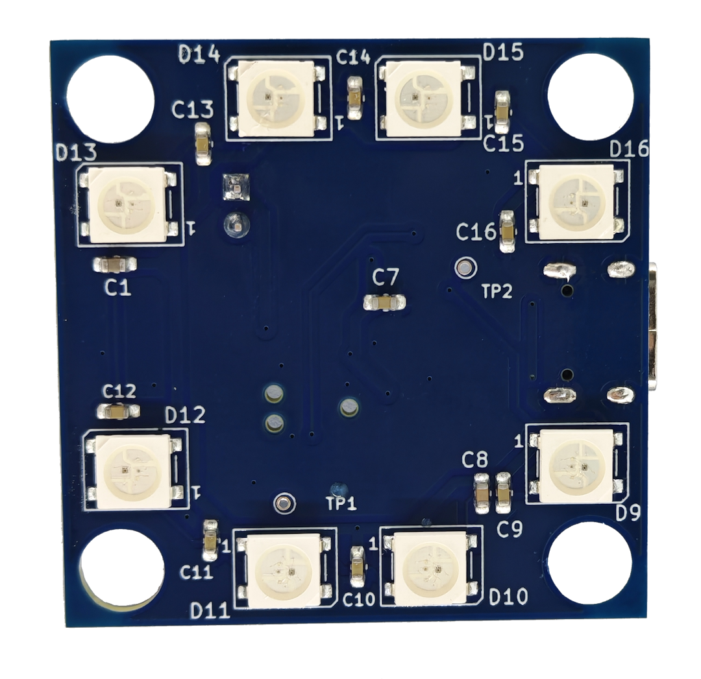

# USB LED Module

A simple USB-controlled LED module for the noknok ecosystem.

## Features
- USB 1.1 interface
- CH32V203 microcontroller
- 8x WS2812b RGB LEDs
- Control via custom USB protocol
- 3.3V logic, 5V power from USB

## Repository Structure
- /hardware — KiCad files, schematics, 3D models (to be created)
- /firmware — Source code and binaries
- /docs — Documentation and usage guides

## Status
- Hardware: v1.0 (in development)
- Firmware: initial version pending

